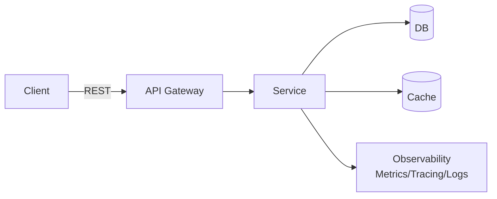

<!-- Banner -->
<p align="center">
  
</p>

<h1 align="center">✨ PROJECT_NAME ✨</h1>
<p align="center"><i>“Göz alıcı, hızlı, güvenilir – dillere destan bir yazılım deneyimi.”</i></p>

<p align="center">
  <a href="https://github.com/owner/repo/actions"></a>
  <a href="https://codecov.io/gh/owner/repo"></a>
  <a href="https://github.com/owner/repo/releases"></a>
  <a href="LICENSE"></a>
  <a href="https://github.com/owner/repo/stargazers"></a>
</p>

<p align="center">
  <a href="#-özellikler">Özellikler</a> •
  <a href="#-hızlı-başlangıç">Hızlı Başlangıç</a> •
  <a href="#-kullanım">Kullanım</a> •
  <a href="#-mimari">Mimari</a> •
  <a href="#-yol-haritası">Yol Haritası</a> •
  <a href="#-katkıda-bulun">Katkı</a> •
  <a href="#%EF%B8%8F-lisans">Lisans</a>
</p>

---

> “İyi yazılım sadece çalışmaz; büyüler.”  
> — Hazırlayan: @isa-katirci_ykb

---

## 🌟 Öne Çıkanlar

- ⚡ Blazing-fast performans: Minimum “overhead”, maksimum hız
- 🧠 Akıllı tasarım: Temiz kod, modüler yapı, esnek konfigürasyon
- 🛡️ Kurumsal seviye güvenlik ve gözlemlenebilirlik
- 🚀 CI/CD hazır: Otomatik test, kalite ve dağıtım hattı
- 🧩 Eklenti dostu mimari: Kolay genişletilebilir
- 🌍 Çoklu ortam desteği: Local/Stage/Prod profilleri

<details>
<summary><b>Biraz da gösteriş ✨</b></summary>

- 🎨 Özenle tasarlanmış README
- 🏆 Rozet yağmuru
- 🧪 Test ve kaliteye tapınma
- 📈 Benchmark ve performans fetişi
- 🔌 Kolay entegrasyon, maksimum saygı
</details>

---

## 🖼️ Ekran Görüntüleri

<p align="center">
  
  <br/>
  <sub>Gösterişli bir arayüz, yalın bir deneyim.</sub>
</p>

---

## ⚙️ Teknoloji Yığını

- Backend: Java 17 / Spring Boot
- İletişim: REST/JSON, OpenAPI
- Veri: PostgreSQL/Oracle (tercihe göre)
- Gözlemlenebilirlik: Micrometer + Prometheus + Grafana
- Paketleme: Docker + OCI
- CI/CD: GitHub Actions

> Not: Bu bir şablondur — kendi stack’inize göre güncelleyin.

---

## 🚀 Hızlı Başlangıç

### Seçenek A: Docker ile

```bash
# 1) İmajı üret
docker build -t owner/repo:latest .

# 2) Çalıştır
docker run -p 8080:8080 --name project_name owner/repo:latest
```

### Seçenek B: Java (Spring Boot)

```bash
# 1) Derle ve paketle
./mvnw clean package -DskipTests

# 2) Çalıştır
java -jar target/project-name-*.jar --spring.profiles.active=local
```

### Ortam Değişkenleri

```
APP_ENV=local
APP_PORT=8080
DB_URL=jdbc:postgresql://localhost:5432/yourdb
DB_USER=youruser
DB_PASS=yourpass
```

---

## 🧪 Kullanım

### REST API

```bash
curl -X GET "http://localhost:8080/api/v1/health" -H "Accept: application/json"
```

Beklenen çıktı:

```json
{ "status": "UP" }
```

### CLI (varsa)

```bash
project-cli --help
```

---

## 🛠️ Konfigürasyon

- application.yml

```yaml
server:
  port: ${APP_PORT:8080}

spring:
  profiles:
    active: ${APP_ENV:local}
```

- Log seviyeleri:

```yaml
logging:
  level:
    root: INFO
    com.yourcompany: DEBUG
```

---

## 🧭 Mimari



- Katmanlar:
  - API: Controller + DTO
  - Servis: Domain mantığı
  - Veri: Repository + DB
  - Ortak: Exception, Mapping, Security, Observability

---

## ⚡ Performans ve Benchmark

- Soğuk start: < 1s (local)
- RPS: 10k+ (sanal test ortamı)
- Ortalama latency: < 20ms

> Rakamlar örnektir. Kendi ortamınızda JMH/Locust/k6 ile tekrar ölçün.

---

## 🧰 Geliştirici Deneyimi

- Kod Stili: Checkstyle/Spotless
- Test: JUnit 5, Testcontainers
- Kalite: SonarQube (isteğe bağlı)
- Git Hooks: pre-commit kalite kontrol

---

## 🗺️ Yol Haritası

- [ ] v1.0 stabil API
- [ ] Gelişmiş caching stratejisi
- [ ] Çoklu DB desteği için soyutlama
- [ ] Üretim kılavuzu ve runbook
- [ ] Örnek dashboard panelleri

> Öneriniz mi var? Issue açın ya da tartışma başlatın!

---

## 🤝 Katkıda Bulun

Katkılar altındır! PR’lar, issue’lar, öneriler — hepsi hoş geldi, sefa geldi.

1. Fork’layın
2. Yeni bir branch açın: `feat/super-ozellik`
3. Testleri çalıştırın
4. PR gönderin

Davranış Kuralları: [CODE_OF_CONDUCT.md](CODE_OF_CONDUCT.md)  
Kılavuz: [CONTRIBUTING.md](CONTRIBUTING.md)

---

## 🧩 SSS

- S: Projeyi hangi JDK ile çalıştırmalıyım?  
  C: Java 17 önerilir.

- S: Docker olmadan deneyebilir miyim?  
  C: Elbette, `java -jar` ile koşabilirsiniz.

- S: Prod’da log seviyeleri?  
  C: INFO ve üzeri; debug sadece arıza incelemesinde.

---

## 🌈 Teşekkürler

- Tüm katkıda bulunanlarımıza
- Açık kaynak topluluğuna
- İlham verici projelere

<p align="center">
  
</p>

---

## ⭐ Destek

Bu projeyi beğendiyseniz bir yıldız bırakın — her ⭐ motivasyon demek!

<p align="center">
  <a href="https://github.com/owner/repo/stargazers">
    
  </a>
</p>

---

## 🧾 Lisans

Bu proje [MIT](LICENSE) lisansı ile lisanslanmıştır.

---

<p align="center">
  <sub>© 2025 PROJECT_NAME — Tüm hakları saklıdır.</sub>
</p>

<!-- Notlar:
- "owner/repo", "PROJECT_NAME", asset yollarını kendi projenize göre güncelleyiniz.
- Rozet linklerindeki ci.yml, codecov vb. iş akışı/entegrasyon adlarını repo’nuzla eşleyiniz.
-->
